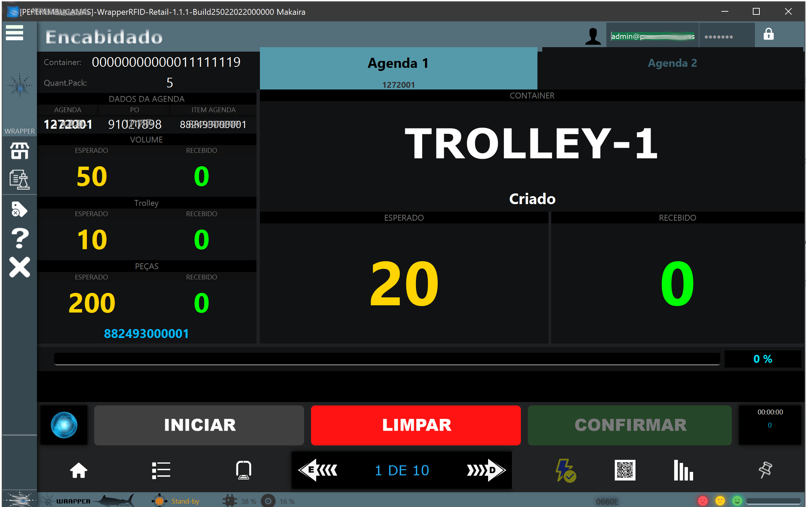

WrapperRFID is a 3-layer software solution, using a JavaFX application as the user interface. It's being used to control the loading and unloading of products by one of the largest retailers in Brazil, by using RFID-technology to track products in a 162,000 m² warehouse. The use of JavaFX was very important for the acceptance and success of the RFID project, providing users with a smooth and very beautiful interface.

